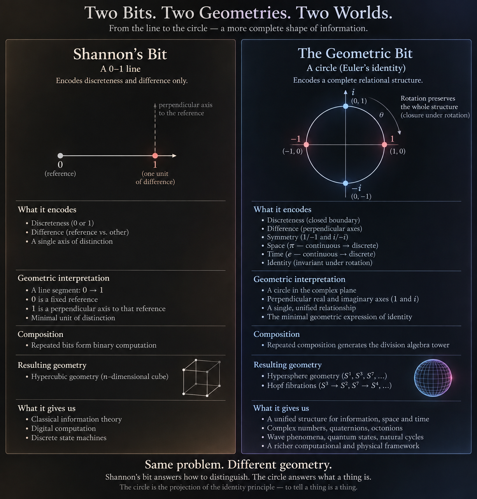
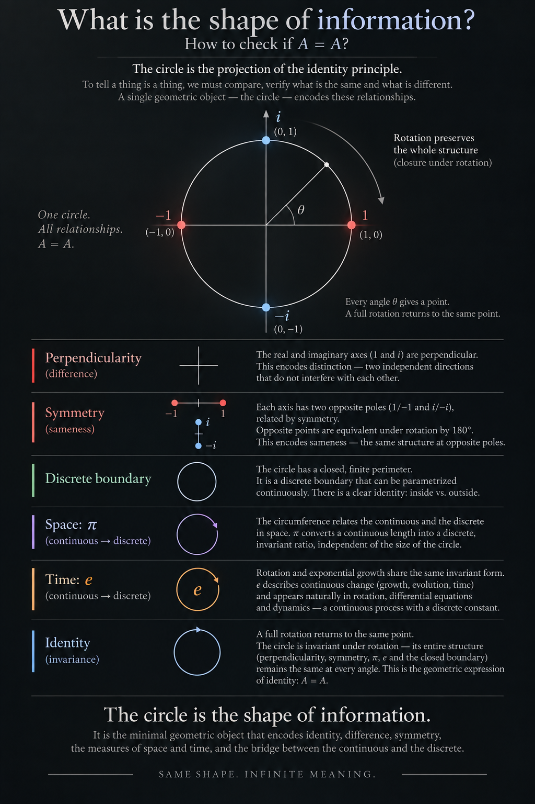

# A Geometrical Theory of Communication
### Measurement, Meaning and Representation

Walter Henrique Alves da Silva · ORCID [0009-0001-0857-096X](https://orcid.org/0009-0001-0857-096X)

> **Work in progress.** This is a working draft, shared openly while it is being written. The text, figures and argument will change before the paper goes to a journal.

## What this is

Shannon's *A Mathematical Theory of Communication* (1948) gave information a number: the bit, one choice between two alternatives. It measures how much was chosen and leaves aside what the choice was about. Weaver named that second question Level B, the problem of meaning: how precisely do the transmitted symbols convey the desired meaning?

This paper takes up Level B. It starts from a simple observation: to tell a thing is a thing, we compare, and every comparison has to check what changed and what stayed the same. The circle does both at once. Its perpendicular axes keep two directions apart, which gives difference. Its opposite poles are exchanged by a half turn, which gives sameness. A full turn returns every point to where it started, which gives identity, `A = A`. Euler's identity, `e^{iπ} + 1 = 0`, writes all of this in one line.

The paper calls this unit the **geometric bit**: a distinction together with the reference and the turn that make it recognizable. Shannon's bit sits inside it as the two opposite poles, with the turn between them set aside.



The argument then follows three questions that together answer what information is: what exists, how we measure and know it, and how we convey it to someone else.



## Files

- `v1.pdf`: the current reading copy
- `v1.tex`: its LaTeX source
- `figures/`: the figures used in the paper and in this page

Build the PDF from this folder with:

```sh
latexmk -pdf v1.tex
```

## Earlier work

This paper continues [*The Geometrical Theory of Communication*](https://doi.org/10.5281/zenodo.15715747) (2025).

## License

[CC BY-NC-SA 4.0](LICENSE)
